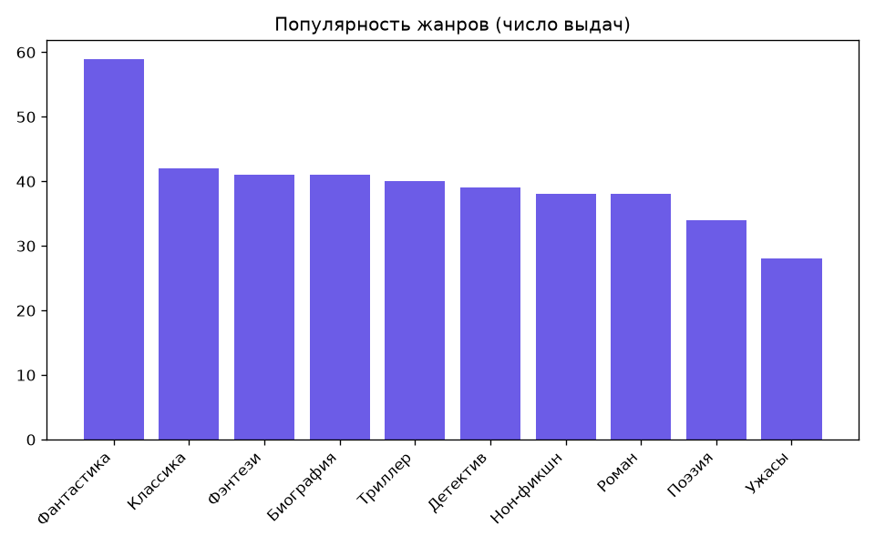
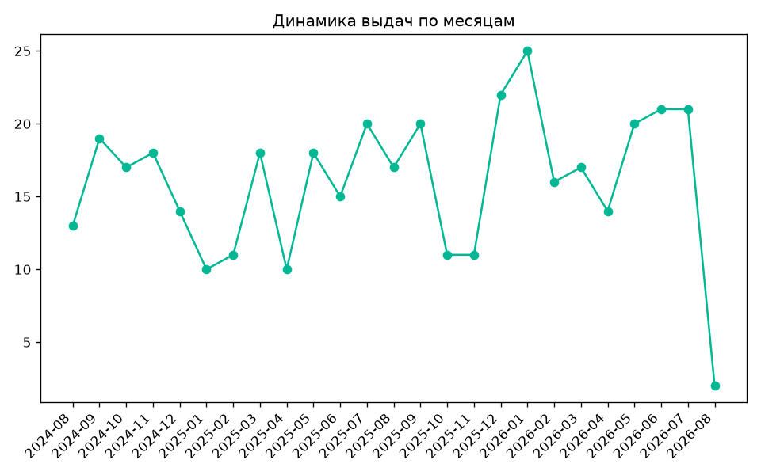
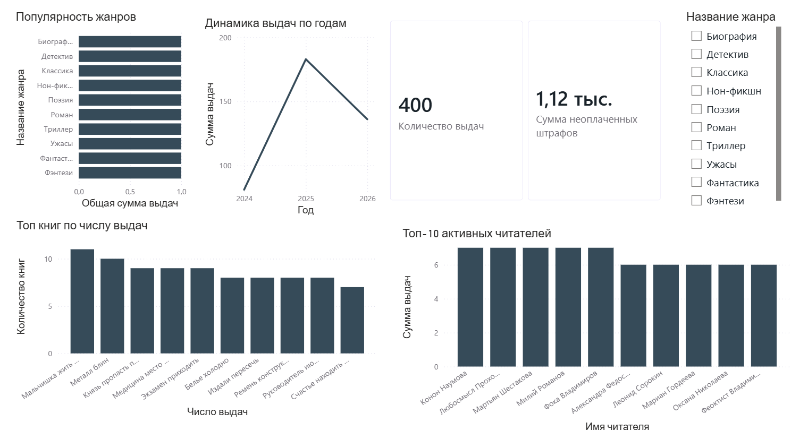

# LibraryAnalytics

Аналитическая система для библиотечного/книжного сервиса: проектирование БД, аналитика на Python и интерактивный дашборд в Power BI.

Учебный pet-проект для портфолио системного аналитика. Цель — показать полный цикл работы с данными: от проектирования схемы БД до готового дашборда с бизнес-метриками.

## Стек

- **MS SQL Server** — база данных, аналитические SQL-запросы
- **Python** (pandas, numpy, sqlalchemy, matplotlib, Faker) — обработка данных, расчёт метрик, генерация тестовых данных
- **Power BI** — интерактивный дашборд

## О проекте

Библиотека хранит информацию о книгах, авторах, издательствах, читателях и выдачах книг. Система отвечает на вопросы:

- какие книги и жанры наиболее популярны
- кто из читателей наиболее активен
- какой процент выдач возвращается с просрочкой
- сколько неоплаченных штрафов и у кого
- как меняется активность выдач во времени

## Структура репозитория

```
LibraryAnalytics
├── database/
│   └── schema.sql             
├── sql/
│   └── analytics_queries.sql  
├── python/
│   ├── charts/
│   ├── generate_data.py        
│   ├── analysis.py             
│   └── requirements.txt
├── powerbi/
│   ├── LibraryAnalytics.pbix   
│   └── exports/                
├── docs/
│   ├── ER-diagram.png
│   ├── dashboard_screenshot
│   └── Business Requirements Document.md
└── README.md
```

## Модель данных

БД включает 7 таблиц: `Authors`, `Genres`, `Publishers`, `Books`, `Readers`, `Loans`, `Fines`.

ER-диаграмма: [docs/ER-diagram.png](docs/ER-diagram.png)

## Аналитика

SQL-запросы (`sql/analytics_queries.sql`) покрывают:
- топ книг и жанров по числу выдач
- активность читателей, сегментация по давности регистрации
- процент просроченных возвратов
- накопительный итог выдач по месяцам (оконные функции)
- средняя сумма штрафа по жанру

Python-скрипт (`python/analysis.py`) выполняет ту же аналитику через pandas, дополнительно строит графики и готовит выгрузки для Power BI.

Примеры графиков, построенных через matplotlib (`python/charts/`):




## Дашборд



Дашборд включает:
- популярность жанров и топ книг
- топ-10 активных читателей
- динамику выдач по времени
- KPI-карточки (общее число выдач, сумма неоплаченных штрафов)
- фильтр по жанру

## Как запустить

1. Выполнить `database/schema.sql` в SSMS/Azure Data Studio — создаст БД и таблицы
2. Установить зависимости: `pip install -r python/requirements.txt`
3. Проверить строку подключения к БД в `python/generate_data.py` и `python/analysis.py`
4. Заполнить БД тестовыми данными: `python python/generate_data.py`
5. Прогнать аналитику и получить csv/графики: `python python/analysis.py`
6. Открыть `powerbi/LibraryAnalytics.pbix` в Power BI Desktop

## Автор


